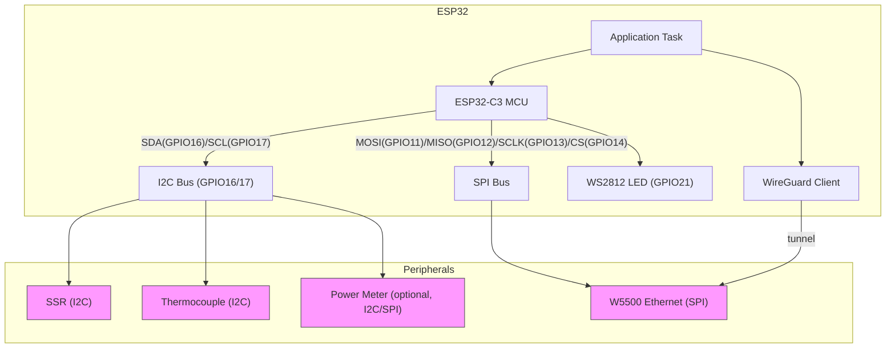
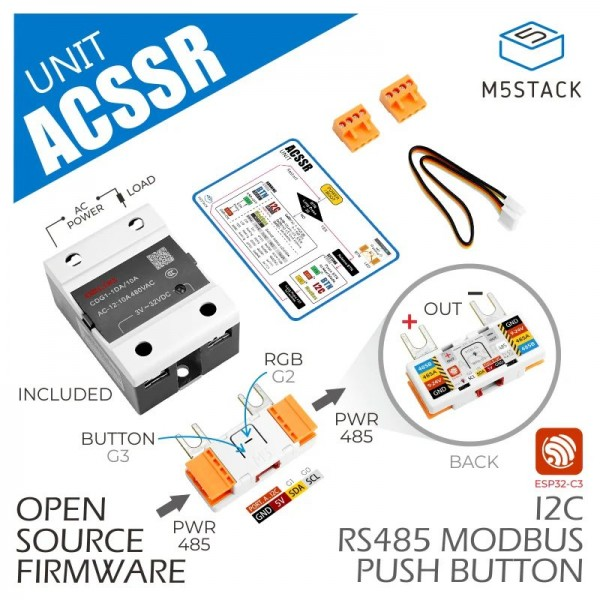

# ESP32C3 W5500 Diepvries — project overzicht

Korte beschrijving
- Doel: een kleine, goed-gedocumenteerde template voor smart-home devices en loggers op basis van ESP32-C3 met W5500 Ethernet, WireGuard en I2C-peripherals (SSR, thermocouple, optionele power-meter).
- Motivatie: bewijzen dat embedded projecten netjes en veilig gebouwd kunnen worden — geen rommelige architectuur of onnodige bugs.

Belangrijkste punten
- Schone C-code principes en modulair ontwerp (zie `docs/ARTICLE.md`).
- Hardware: WS2812 status-LED, W5500 via SPI, meerdere I2C-devices (SSR, thermocouple, optioneel power meter).
- Netwerk: W5500 Ethernet met WireGuard client voor veilige remote toegang.

Mermaid architectuurdiagram



Pinout (actuele mappings)

| Signaal | Device | ESP32 GPIO | Opmerkingen |
|---|---:|---:|---|
| WS2812 data | Status LED | GPIO21 | WS2812 (single-wire) |
| I2C SDA | I2C bus | GPIO16 | Pull-ups 4.7k aanbevolen |
| I2C SCL | I2C bus | GPIO17 | Pull-ups 4.7k aanbevolen |
| I2C - SSR | SSR (I2C) | via I2C | I2C-adres: configureer in driver (placeholder 0xXX) |
| I2C - Thermocouple | Thermocouple (I2C) | via I2C | I2C-adres: configureer in driver (placeholder 0xYY) |
| SPI_MOSI | W5500 MOSI | GPIO11 | |
| SPI_MISO | W5500 MISO | GPIO12 | |
| SPI_SCLK | W5500 SCLK | GPIO13 | |
| SPI_CS | W5500 CS | GPIO14 | |
| ETH_INT | W5500 INT | GPIO10 | Interrupt lijn van W5500 naar MCU |
| ETH_RST | W5500 RST | GPIO9 | Hardware reset voor W5500 |
| Power meter (opt) | PWR sensor | (I2C/SPI/ADC) | afhankelijk module |


https://docs.m5stack.com/en/unit/acssr

### SSR (I2C slave)



**I2C-adres:** `0x50`

| Register      | Access | Beschrijving            | Waarden / Opmerking        |
|---------------|--------|-------------------------|----------------------------|
| `0x00`        | R/W    | Power state             | `1 = ON`, `0 = OFF`        |
| `0x20`        | R/W    | Slave address           | Nieuw I2C slave-adres      |
| `0x10`-`0x12` | R/W    | RGB LED registers       | `0x10=R`, `0x11=G`, `0x12=B` |
| `0xFE`        | R      | Version number          | Firmware/hardware versie   |

### Thermocouple (I2C slave)


Coding style & filosofie (kort)
- Doelgroep: HBO embedded studenten — begrijpbaar en toepasbaar.
- Korte functies, duidelijke namen, modulair: `.c` + `.h` per module.
- Init/read/write API per module; fouten via enum return-codes.
- Geen onnodige globals; gebruik configuratie-structs.
- Loggen via centraal `log_printf(level, ...)`.
- Non-blocking hoofdloop; timing via timers/RTOS tasks.
- `const`-correctness, header guards, typedef-structs, enums voor errors.

Quickstart
1. Zorg dat je ESP-IDF toolchain geconfigureerd is (of je gebruikelijke build-flow).
2. Build & flash zoals je normaal doet via `idf.py build flash` of je eigen script.
3. Configureer WireGuard keys en voeg peer toe op je telefoon/remote.


# ESP32-S3 standaard ESP-IDF project (CLI, Linux)

Dit is een **minimaal ESP-IDF** project (zonder PlatformIO) voor:

- ESP32-S3
- 16MB flash
- 8MB PSRAM
- W5500 (SPI ethernet)
- LED blink via `esp_timer`

## Projectstructuur

```text
examples/esp32s3_idf_minimal/
├── CMakeLists.txt
├── sdkconfig.defaults
└── main/
    ├── CMakeLists.txt
    └── main.c
```

## 1) ESP-IDF installeren (eenmalig op Linux)

```bash
mkdir -p ~/esp
cd ~/esp
git clone --recursive https://github.com/espressif/esp-idf.git
cd esp-idf
./install.sh esp32s3
```

Elke nieuwe shell sessie:

```bash
source ~/esp/esp-idf/export.sh
```

Controle:

```bash
idf.py --version
```

## 2) Project bouwen vanaf command line

```bash
cd /workspace/prompt_engineering/examples/esp32s3_idf_minimal
idf.py set-target esp32s3
idf.py build
```

Wat dit doet:
- target op `esp32s3`
- defaults laden uit `sdkconfig.defaults` (o.a. 16MB flash + PSRAM + W5500)
- compile + link firmware

## 3) Flashen

```bash
idf.py -p /dev/ttyUSB0 flash
```

Als je poort anders is (bijv. `/dev/ttyACM0`), pas de `-p` waarde aan.

## 4) Monitor

```bash
idf.py -p /dev/ttyUSB0 monitor
```

Verwachte log:

```text
I (...) app_main: led_init: ok
I (...) app_main: timer_init: ok
I (...) app_main: eth_w5500_init: ok
I (...) app_main: running: led blink timer=500000 us + W5500 up
```

## Hardware mapping voor W5500

In `main/main.c` staan default pinnen. Pas die aan aan jouw board:

- `g_pin_spi_miso`
- `g_pin_spi_mosi`
- `g_pin_spi_sclk`
- `g_pin_spi_cs`
- `g_pin_eth_int`
- `g_pin_eth_rst`

## Waarom dit minimaal en robuust is

- Platte C met expliciete state (`static` globals)
- Geen app-level heap allocatie in eigen code
- Expliciete tagged-union error returns (`app_status_t`)
- Geen verborgen control flow
